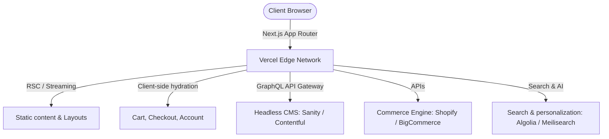

# E-Commerce Frontend: Architectural Overview (Editorial Luxury Style)

This document outlines the high-performance, modern architectural principles recommended by the HopeRise Agency for premium brand storefronts. In 2026, building a high-end e-commerce website requires moving away from monolithic platforms toward a decoupled, composable, and headless architecture.

---

## 1. Core Architectural Pillars

### A. Headless & Composable Structure
- **Decoupled System**: We separate the customer-facing presentation layer (frontend) from the transactional backend engines (Shopify, BigCommerce, or custom engines).
- **Flexibility**: Marketing teams can publish and update campaign layouts via a Headless CMS (e.g. Sanity, Contentful) without invoking full application deployments.
- **Speed**: Decoupled frontends load static assets instantly via Global Edge Delivery (CDN), bypassing heavy database lookups on the initial request.

### B. Server Components & Hybrid Rendering
- **Next.js Server Components (RSC)**: 85% of page code is executed on the server, serving pure HTML and zero client-side JavaScript by default.
- **Interactive Islands**: Dynamic features (such as shopping carts, search inputs, and checkout forms) are isolated into client-side leaf nodes (`"use client"`), keeping the main bundle size extremely lean.
- **Incremental Static Regeneration (ISR)**: Product catalog and category grids are pre-rendered at build time and updated in the background as prices or inventory change, guaranteeing a sub-second Time-to-First-Byte (TTFB).

### C. Edge-Middleware Optimization
- **Dynamic Localization**: Currency conversion, regional catalog selection, and tax adjustments are resolved in lightweight Edge functions, running close to the client to eliminate latency.
- **A/B Testing Integration**: Directing users to alternative layout paths happens at the CDN routing level (Edge Middleware) rather than in client-side Javascript, preventing visual layout shifts (CLS).

---

## 2. Technical Performance Targets

For premium branding, speed *is* the brand. A slow page load ruins customer confidence. We enforce the following Core Web Vitals targets:

| Metric | Industry Standard | HopeRise Target | Business Impact |
|--------|-------------------|-----------------|-----------------|
| **LCP** (Largest Contentful Paint) | < 2.5s | **< 1.2s** | Higher organic Google search rankings |
| **CLS** (Layout Shift) | < 0.10 | **< 0.02** | Frictionless buying, zero accidental clicks |
| **INP** (Interaction to Next Paint) | < 200ms | **< 60ms** | Tactile, responsive button hovers/clicks |
